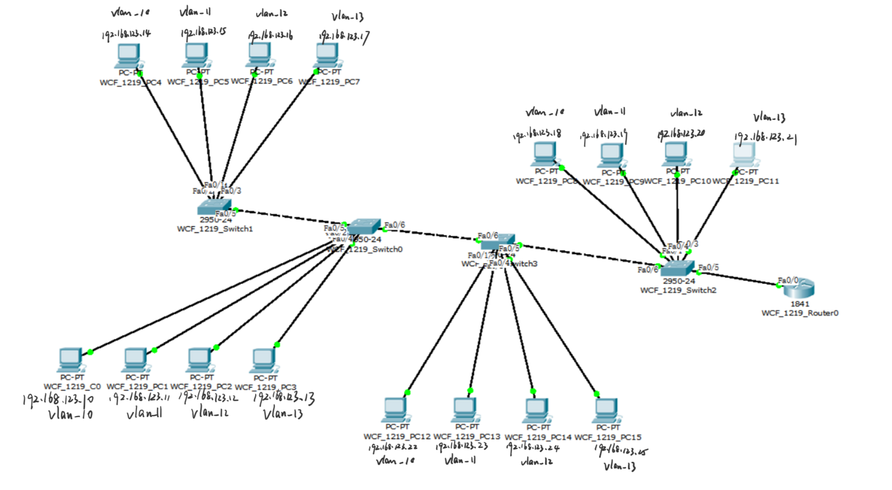
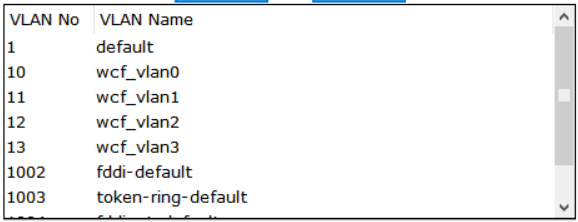
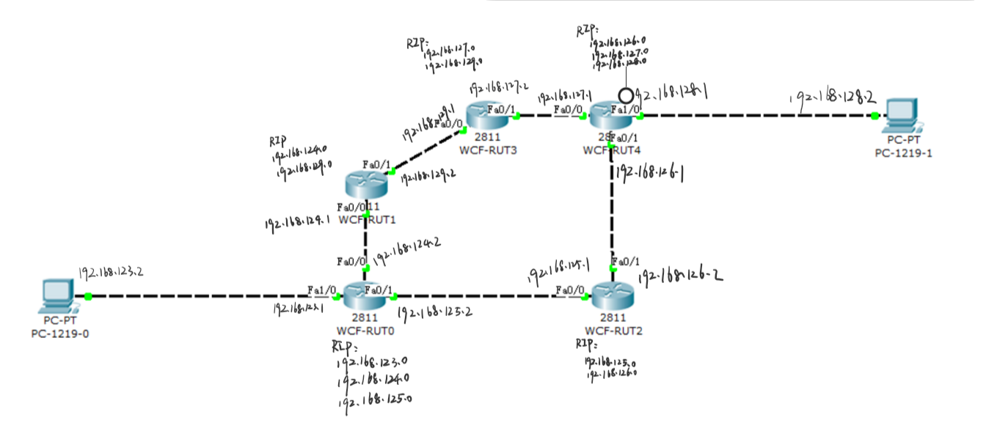
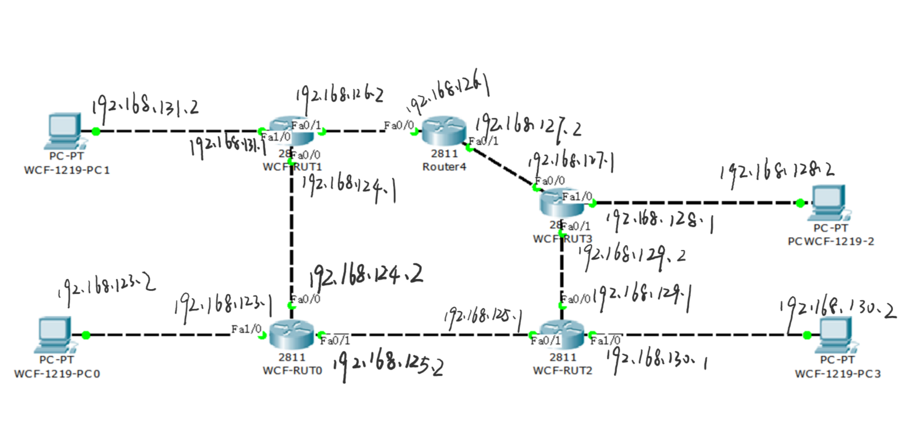

# <center>计算机网络课程设计实验报告</center>
```
浙江工业大学 基础课程大型试验

实验学期：2019/2020(1)

实验题目：计算机网络课程设计

学生姓名：王程飞

学生学号：201806061219

学生班级：2018软件工程05班

提交日期：2019年12月31日
```

### 任务一
(1) 写出常用网络命令 ipconfig, ping, netstat, tracert, arp, telnet 的功能
(2) 在windows环境下使用上述网络命令进行网络状态监测和跟踪，给出相应的截图和对结果的解释

#### `ipconfig [/all]`
>从高速缓存中读取或更改项

该命令可以查看本机的以太网适配器信息，IP信息，子网掩码等，如果加上 /all，则可以查看MAC地址，DNS等更多的信息

更多用法

```bat
PS C:\Users\wcf> ipconfig /?

用法:
    ipconfig [/allcompartments] [/? | /all |
                                 /renew [adapter] | /release [adapter] |
                                 /renew6 [adapter] | /release6 [adapter] |
                                 /flushdns | /displaydns | /registerdns |
                                 /showclassid adapter |
                                 /setclassid adapter [classid] |
                                 /showclassid6 adapter |
                                 /setclassid6 adapter [classid] ]

其中
    adapter             连接名称
                       (允许使用通配符 * 和 ?，参见示例)

    选项:
       /?               显示此帮助消息
       /all             显示完整配置信息。
       /release         释放指定适配器的 IPv4 地址。
       /release6        释放指定适配器的 IPv6 地址。
       /renew           更新指定适配器的 IPv4 地址。
       /renew6          更新指定适配器的 IPv6 地址。
       /flushdns        清除 DNS 解析程序缓存。
       /registerdns     刷新所有 DHCP 租用并重新注册 DNS 名称
       /displaydns      显示 DNS 解析程序缓存的内容。
       /showclassid     显示适配器允许的所有 DHCP 类 ID。
       /setclassid      修改 DHCP 类 ID。
       /showclassid6    显示适配器允许的所有 IPv6 DHCP 类 ID。
       /setclassid6     修改 IPv6 DHCP 类 ID。


默认情况下，仅显示绑定到 TCP/IP 的每个适配器的 IP 地址、子网掩码和
默认网关。

对于 Release 和 Renew，如果未指定适配器名称，则会释放或更新所有绑定
到 TCP/IP 的适配器的 IP 地址租用。

对于 Setclassid 和 Setclassid6，如果未指定 ClassId，则会删除 ClassId。

示例:
    > ipconfig                       ... 显示信息
    > ipconfig /all                  ... 显示详细信息
    > ipconfig /renew                ... 更新所有适配器
    > ipconfig /renew EL*            ... 更新所有名称以 EL 开头
                                         的连接
    > ipconfig /release *Con*        ... 释放所有匹配的连接，
                                         例如“有线以太网连接 1”或
                                             “有线以太网连接 2”
    > ipconfig /allcompartments      ... 显示有关所有隔离舱的
                                         信息
    > ipconfig /allcompartments /all ... 显示有关所有隔离舱的
                                         详细信息
```

```bat
PS C:\Users\wcf> ipconfig /all

Windows IP 配置

   主机名  . . . . . . . . . . . . . : WCF-SURFACE
   主 DNS 后缀 . . . . . . . . . . . :
   节点类型  . . . . . . . . . . . . : 混合
   IP 路由已启用 . . . . . . . . . . : 否
   WINS 代理已启用 . . . . . . . . . : 否

无线局域网适配器 本地连接* 1:

   媒体状态  . . . . . . . . . . . . : 媒体已断开连接
   连接特定的 DNS 后缀 . . . . . . . :
   描述. . . . . . . . . . . . . . . : Microsoft Wi-Fi Direct Virtual Adapter
   物理地址. . . . . . . . . . . . . : DA-C4-97-E5-8C-F2
   DHCP 已启用 . . . . . . . . . . . : 是
   自动配置已启用. . . . . . . . . . : 是

无线局域网适配器 本地连接* 2:

   媒体状态  . . . . . . . . . . . . : 媒体已断开连接
   连接特定的 DNS 后缀 . . . . . . . :
   描述. . . . . . . . . . . . . . . : Microsoft Wi-Fi Direct Virtual Adapter #2
   物理地址. . . . . . . . . . . . . : EA-C4-97-E5-8C-F2
   DHCP 已启用 . . . . . . . . . . . : 是
   自动配置已启用. . . . . . . . . . : 是

无线局域网适配器 WLAN:

   连接特定的 DNS 后缀 . . . . . . . :
   描述. . . . . . . . . . . . . . . : Qualcomm Atheros QCA61x4A Wireless Network Adapter
   物理地址. . . . . . . . . . . . . : D8-C4-97-E5-8C-F2
   DHCP 已启用 . . . . . . . . . . . : 是
   自动配置已启用. . . . . . . . . . : 是
   IPv6 地址 . . . . . . . . . . . . : 2409:8928:836:4cb7:65ea:e332:ea6:f74f(首选)
   临时 IPv6 地址. . . . . . . . . . : 2409:8928:836:4cb7:e963:ac97:bb48:9774(首选)
   本地链接 IPv6 地址. . . . . . . . : fe80::65ea:e332:ea6:f74f%12(首选)
   IPv4 地址 . . . . . . . . . . . . : 192.168.43.150(首选)
   子网掩码  . . . . . . . . . . . . : 255.255.255.0
   获得租约的时间  . . . . . . . . . : 2019年12月14日 14:25:38
   租约过期的时间  . . . . . . . . . : 2019年12月14日 16:25:55
   默认网关. . . . . . . . . . . . . : fe80::94a4:2eff:fe09:da4%12
                                       192.168.43.1
   DHCP 服务器 . . . . . . . . . . . : 192.168.43.1
   DHCPv6 IAID . . . . . . . . . . . : 114869399
   DHCPv6 客户端 DUID  . . . . . . . : 00-01-00-01-25-22-06-E1-D8-C4-97-E5-8C-F2
   DNS 服务器  . . . . . . . . . . . : 192.168.43.1
   TCPIP 上的 NetBIOS  . . . . . . . : 已启用

以太网适配器 蓝牙网络连接:

   媒体状态  . . . . . . . . . . . . : 媒体已断开连接
   连接特定的 DNS 后缀 . . . . . . . :
   描述. . . . . . . . . . . . . . . : Bluetooth Device (Personal Area Network)
   物理地址. . . . . . . . . . . . . : D8-C4-97-E5-8C-F3
   DHCP 已启用 . . . . . . . . . . . : 是
   自动配置已启用. . . . . . . . . . : 是

隧道适配器 Teredo Tunneling Pseudo-Interface:

   连接特定的 DNS 后缀 . . . . . . . :
   描述. . . . . . . . . . . . . . . : Microsoft Teredo Tunneling Adapter
   物理地址. . . . . . . . . . . . . : 00-00-00-00-00-00-00-E0
   DHCP 已启用 . . . . . . . . . . . : 否
   自动配置已启用. . . . . . . . . . : 是
   IPv6 地址 . . . . . . . . . . . . : 2001:0:284a:364:34e1:6685:8fee:8ac(首选)
   本地链接 IPv6 地址. . . . . . . . : fe80::34e1:6685:8fee:8ac%13(首选)
   默认网关. . . . . . . . . . . . . :
   DHCPv6 IAID . . . . . . . . . . . : 167772160
   DHCPv6 客户端 DUID  . . . . . . . : 00-01-00-01-25-22-06-E1-D8-C4-97-E5-8C-F2
   TCPIP 上的 NetBIOS  . . . . . . . : 已禁用
```

#### `ping`
>通过向目标计算机发送一段ICMP报文并由目标发送回来，计算时间和TTL获取需要的数据

ping 命令用于测试网络连接和连接质量，同时可以获取域名解析到的IP地址
基本用法为 **ping ip**，Windows下默认 ping 4次，如果加上参数 -t 则可以持续 ping 下去
它可以用 -l size 来指定缓冲区大小，最大为65500
更多的参数用法

```bat
PS C:\Users\wcf> ping /?

用法: ping [-t] [-a] [-n count] [-l size] [-f] [-i TTL] [-v TOS]
            [-r count] [-s count] [[-j host-list] | [-k host-list]]
            [-w timeout] [-R] [-S srcaddr] [-c compartment] [-p]
            [-4] [-6] target_name

选项:
    -t             Ping 指定的主机，直到停止。
                   若要查看统计信息并继续操作，请键入 Ctrl+Break；
                   若要停止，请键入 Ctrl+C。
    -a             将地址解析为主机名。
    -n count       要发送的回显请求数。
    -l size        发送缓冲区大小。
    -f             在数据包中设置“不分段”标记(仅适用于 IPv4)。
    -i TTL         生存时间。
    -v TOS         服务类型(仅适用于 IPv4。该设置已被弃用，
                   对 IP 标头中的服务类型字段没有任何
                   影响)。
    -r count       记录计数跃点的路由(仅适用于 IPv4)。
    -s count       计数跃点的时间戳(仅适用于 IPv4)。
    -j host-list   与主机列表一起使用的松散源路由(仅适用于 IPv4)。
    -k host-list    与主机列表一起使用的严格源路由(仅适用于 IPv4)。
    -w timeout     等待每次回复的超时时间(毫秒)。
    -R             同样使用路由标头测试反向路由(仅适用于 IPv6)。
                   根据 RFC 5095，已弃用此路由标头。
                   如果使用此标头，某些系统可能丢弃
                   回显请求。
    -S srcaddr     要使用的源地址。
    -c compartment 路由隔离舱标识符。
    -p             Ping Hyper-V 网络虚拟化提供程序地址。
    -4             强制使用 IPv4。
    -6             强制使用 IPv6。
```

```bat
# ping 上海阿里云服务器
PS C:\Users\wcf> ping 47.102.200.155

正在 Ping 47.102.200.155 具有 32 字节的数据:
来自 47.102.200.155 的回复: 字节=32 时间=81ms TTL=48
来自 47.102.200.155 的回复: 字节=32 时间=58ms TTL=48
来自 47.102.200.155 的回复: 字节=32 时间=56ms TTL=48
来自 47.102.200.155 的回复: 字节=32 时间=46ms TTL=48
# 缓冲区大小为32字节时时间在46-81ms，平均60ms，TTL为48
47.102.200.155 的 Ping 统计信息:
    数据包: 已发送 = 4，已接收 = 4，丢失 = 0 (0% 丢失)，
往返行程的估计时间(以毫秒为单位):
    最短 = 46ms，最长 = 81ms，平均 = 60ms

# ping baidu.com
PS C:\Users\wcf> ping baidu.com

正在 Ping baidu.com [39.156.69.79] 具有 32 字节的数据:
来自 39.156.69.79 的回复: 字节=32 时间=60ms TTL=50
来自 39.156.69.79 的回复: 字节=32 时间=68ms TTL=50
来自 39.156.69.79 的回复: 字节=32 时间=79ms TTL=50
来自 39.156.69.79 的回复: 字节=32 时间=87ms TTL=50

39.156.69.79 的 Ping 统计信息:
    数据包: 已发送 = 4，已接收 = 4，丢失 = 0 (0% 丢失)，
往返行程的估计时间(以毫秒为单位):
    最短 = 60ms，最长 = 87ms，平均 = 73ms
```

#### `netstat`
用于显示协议统计信息和当前 TCP/IP 网络连接，可以显示协议，本地地址，外部地址，端口号，应用进程(-o)等

```bat
PS C:\Users\wcf> netstat /?

显示协议统计信息和当前 TCP/IP 网络连接。

NETSTAT [-a] [-b] [-e] [-f] [-n] [-o] [-p proto] [-r] [-s] [-x] [-t] [interval]

  -a            显示所有连接和侦听端口。
  -b            显示在创建每个连接或侦听端口时涉及的
                可执行程序。在某些情况下，已知可执行程序承载
                多个独立的组件，这些情况下，
                显示创建连接或侦听端口时
                涉及的组件序列。在此情况下，可执行程序的
                名称位于底部 [] 中，它调用的组件位于顶部，
                直至达到 TCP/IP。注意，此选项
                可能很耗时，并且在你没有足够
                权限时可能失败。
  -e            显示以太网统计信息。此选项可以与 -s 选项
                结合使用。
  -f            显示外部地址的完全限定
                域名(FQDN)。
  -n            以数字形式显示地址和端口号。
  -o            显示拥有的与每个连接关联的进程 ID。
  -p proto      显示 proto 指定的协议的连接；proto
                可以是下列任何一个: TCP、UDP、TCPv6 或 UDPv6。如果与 -s
                选项一起用来显示每个协议的统计信息，proto 可以是下列任何一个:
                IP、IPv6、ICMP、ICMPv6、TCP、TCPv6、UDP 或 UDPv6。
  -q            显示所有连接、侦听端口和绑定的
                非侦听 TCP 端口。绑定的非侦听端口
                 不一定与活动连接相关联。
  -r            显示路由表。
  -s            显示每个协议的统计信息。默认情况下，
                显示 IP、IPv6、ICMP、ICMPv6、TCP、TCPv6、UDP 和 UDPv6 的统计信息;
                -p 选项可用于指定默认的子网。
  -t            显示当前连接卸载状态。
  -x            显示 NetworkDirect 连接、侦听器和共享
                终结点。
  -y            显示所有连接的 TCP 连接模板。
                无法与其他选项结合使用。
  interval      重新显示选定的统计信息，各个显示间暂停的
                间隔秒数。按 CTRL+C 停止重新显示
                统计信息。如果省略，则 netstat 将打印当前的
                配置信息一次。
```

```bat
# -a 显示所有连接和端口，-n 数字形式显示地址和端口，-o 显示PID
PS C:\Users\wcf> netstat -ano

活动连接
# 外部地址 本地和外部建立连接的地址
# 状态： LISTENING正在监听 ESTABLISHED已经建立连接 CLOSE_WAIT等待从本地用户发来的连接中断请求 LAST_ACK等待原来发向远程TCP的连接中断请求的确认
  协议   本地地址               外部地址               状态             PID
  TCP    0.0.0.0:135            0.0.0.0:0              LISTENING       624
  TCP    0.0.0.0:445            0.0.0.0:0              LISTENING       4
  TCP    0.0.0.0:5040           0.0.0.0:0              LISTENING       7736
  TCP    0.0.0.0:5357           0.0.0.0:0              LISTENING       4
  TCP    0.0.0.0:7680           0.0.0.0:0              LISTENING       3736
  TCP    0.0.0.0:49664          0.0.0.0:0              LISTENING       876
  TCP    0.0.0.0:49665          0.0.0.0:0              LISTENING       720
  TCP    0.0.0.0:49666          0.0.0.0:0              LISTENING       2020
  TCP    0.0.0.0:49667          0.0.0.0:0              LISTENING       2940
  TCP    0.0.0.0:49668          0.0.0.0:0              LISTENING       2720
  TCP    0.0.0.0:49669          0.0.0.0:0              LISTENING       3916
  TCP    0.0.0.0:49670          0.0.0.0:0              LISTENING       840
  TCP    127.0.0.1:63295        0.0.0.0:0              LISTENING       16748
  TCP    192.168.43.150:139     0.0.0.0:0              LISTENING       4
  TCP    192.168.43.150:49599   40.90.189.152:443      ESTABLISHED     4384
  TCP    192.168.43.150:63331   20.185.75.141:443      CLOSE_WAIT      14744
  TCP    192.168.43.150:63356   112.13.113.191:443     CLOSE_WAIT      14744
  TCP    192.168.43.150:63396   13.107.18.254:443      ESTABLISHED     13484
  TCP    192.168.43.150:63403   112.15.254.35:443      CLOSE_WAIT      14744
  TCP    192.168.43.150:63404   112.15.254.35:443      CLOSE_WAIT      14744
  TCP    192.168.43.150:63405   112.15.254.35:443      CLOSE_WAIT      14744
  TCP    192.168.43.150:63406   112.15.254.35:443      CLOSE_WAIT      14744
  TCP    192.168.43.150:63407   112.15.254.35:443      CLOSE_WAIT      14744
  TCP    192.168.43.150:63408   112.15.254.35:443      CLOSE_WAIT      14744
  TCP    192.168.43.150:63409   112.15.254.35:443      CLOSE_WAIT      14744
  TCP    192.168.43.150:63410   112.15.254.35:443      CLOSE_WAIT      14744
  TCP    192.168.43.150:63411   112.15.254.35:443      CLOSE_WAIT      14744
  TCP    192.168.43.150:63444   13.107.136.9:443       ESTABLISHED     5224
  TCP    192.168.43.150:63541   52.114.132.73:443      ESTABLISHED     5476
  TCP    192.168.43.150:63570   52.109.48.2:443        ESTABLISHED     5224
  TCP    192.168.43.150:63590   52.109.48.2:443        ESTABLISHED     5224
  TCP    192.168.43.150:63623   23.1.20.98:443         ESTABLISHED     4476
  TCP    192.168.43.150:63745   42.121.254.191:443     CLOSE_WAIT      4476
  TCP    192.168.43.150:63756   112.13.208.117:443     CLOSE_WAIT      4476
  TCP    192.168.43.150:63758   112.13.208.117:443     CLOSE_WAIT      4476
  TCP    192.168.43.150:63759   112.13.208.117:443     CLOSE_WAIT      4476
  TCP    192.168.43.150:63764   112.13.209.46:443      CLOSE_WAIT      4476
  TCP    192.168.43.150:63765   112.13.209.46:443      CLOSE_WAIT      4476
  TCP    192.168.43.150:63770   40.119.211.203:443     ESTABLISHED     4476
  TCP    192.168.43.150:63771   54.169.195.247:443     CLOSE_WAIT      11996
  TCP    192.168.43.150:63789   52.114.77.33:443       ESTABLISHED     4512
  TCP    192.168.43.150:63790   52.114.77.33:443       ESTABLISHED     10072
  TCP    192.168.43.150:63792   52.114.77.33:443       ESTABLISHED     10072
  TCP    192.168.43.150:63795   52.114.77.33:443       ESTABLISHED     5476
  TCP    192.168.43.150:63799   40.90.185.223:443      ESTABLISHED     4256
  TCP    192.168.43.150:63800   52.109.44.28:443       ESTABLISHED     5224
  TCP    192.168.43.150:63801   52.109.44.28:443       ESTABLISHED     5224
  TCP    192.168.43.150:63802   52.109.44.28:443       ESTABLISHED     5224
  TCP    192.168.43.150:63803   52.109.44.28:443       ESTABLISHED     5224
  TCP    192.168.43.150:63804   52.109.44.28:443       ESTABLISHED     5224
  TCP    192.168.43.150:63805   52.109.44.28:443       ESTABLISHED     5224
  TCP    192.168.43.150:63806   52.109.48.0:443        ESTABLISHED     5224
  TCP    192.168.43.150:63808   52.114.6.46:443        ESTABLISHED     11880
  TCP    192.168.43.150:63809   20.189.78.37:443       ESTABLISHED     11880
  TCP    192.168.43.150:63810   40.77.226.250:443      LAST_ACK        3184
  TCP    192.168.43.150:63812   52.74.223.119:443      ESTABLISHED     6640
  TCP    [::]:135               [::]:0                 LISTENING       624
  TCP    [::]:445               [::]:0                 LISTENING       4
  TCP    [::]:5357              [::]:0                 LISTENING       4
  TCP    [::]:7680              [::]:0                 LISTENING       3736
  TCP    [::]:49664             [::]:0                 LISTENING       876
  TCP    [::]:49665             [::]:0                 LISTENING       720
  TCP    [::]:49666             [::]:0                 LISTENING       2020
  TCP    [::]:49667             [::]:0                 LISTENING       2940
  TCP    [::]:49668             [::]:0                 LISTENING       2720
  TCP    [::]:49669             [::]:0                 LISTENING       3916
  TCP    [::]:49670             [::]:0                 LISTENING       840
  TCP    [2409:8928:836:4cb7:e963:ac97:bb48:9774]:62808  [2620:1ec:a92::171]:443  ESTABLISHED     4476
  TCP    [2409:8928:836:4cb7:e963:ac97:bb48:9774]:63650  [2402:4f00:4002:400::df77:f811]:443  ESTABLISHED     4476
  UDP    0.0.0.0:123            *:*                                    11428
  UDP    0.0.0.0:3702           *:*                                    6608
  UDP    0.0.0.0:3702           *:*                                    6608
  UDP    0.0.0.0:5050           *:*                                    7736
  UDP    0.0.0.0:5353           *:*                                    1228
  UDP    0.0.0.0:5353           *:*                                    1228
  UDP    0.0.0.0:5353           *:*                                    1228
  UDP    0.0.0.0:5353           *:*                                    2932
  UDP    0.0.0.0:5353           *:*                                    4476
  UDP    0.0.0.0:5353           *:*                                    4476
  UDP    0.0.0.0:5355           *:*                                    2932
  UDP    0.0.0.0:51707          *:*                                    6608
  UDP    0.0.0.0:53305          *:*                                    4476
  UDP    0.0.0.0:53306          *:*                                    4476
  UDP    0.0.0.0:63233          *:*                                    11880
  UDP    127.0.0.1:1900         *:*                                    5680
  UDP    127.0.0.1:49664        *:*                                    4664
  UDP    127.0.0.1:52253        *:*                                    5680
  UDP    192.168.43.150:137     *:*                                    4
  UDP    192.168.43.150:138     *:*                                    4
  UDP    192.168.43.150:1900    *:*                                    5680
  UDP    192.168.43.150:2177    *:*                                    8812
  UDP    192.168.43.150:52252   *:*                                    5680
  UDP    [::]:123               *:*                                    11428
  UDP    [::]:3702              *:*                                    6608
  UDP    [::]:3702              *:*                                    6608
  UDP    [::]:5353              *:*                                    2932
  UDP    [::]:5353              *:*                                    4476
  UDP    [::]:5353              *:*                                    1228
  UDP    [::]:5353              *:*                                    1228
  UDP    [::]:5355              *:*                                    2932
  UDP    [::]:51708             *:*                                    6608
  UDP    [::]:53306             *:*                                    4476
  UDP    [::]:63233             *:*                                    11880
  UDP    [::1]:1900             *:*                                    5680
  UDP    [::1]:52251            *:*                                    5680
  UDP    [2409:8928:836:4cb7:65ea:e332:ea6:f74f]:2177  *:*                                    8812
  UDP    [2409:8928:836:4cb7:e963:ac97:bb48:9774]:2177  *:*                                    8812
  UDP    [fe80::65ea:e332:ea6:f74f%12]:1900  *:*                                    5680
  UDP    [fe80::65ea:e332:ea6:f74f%12]:2177  *:*                                    8812
  UDP    [fe80::65ea:e332:ea6:f74f%12]:52250  *:*                                    5680
  ```

#### `tracert`
>利用ICMP差错报文，先使用UDP协议发送一个TTL为1，端口号不可达(>30000)的报文，在第一跳超时后返回差错信息，再发送TTL为2的报文，会在第二跳超时...，最后可完整跟踪到目标计算机的路由，到达目标计算机的依据是目标端口不可达而不是超时

tracert ip 可以跟踪到某个地址的路由
```bat
PS C:\Users\wcf> tracert /?

用法: tracert [-d] [-h maximum_hops] [-j host-list] [-w timeout]
               [-R] [-S srcaddr] [-4] [-6] target_name

选项:
    -d                 不将地址解析成主机名。
    -h maximum_hops    搜索目标的最大跃点数。
    -j host-list       与主机列表一起的松散源路由(仅适用于 IPv4)。
    -w timeout         等待每个回复的超时时间(以毫秒为单位)。
    -R                 跟踪往返行程路径(仅适用于 IPv6)。
    -S srcaddr         要使用的源地址(仅适用于 IPv6)。
    -4                 强制使用 IPv4。
    -6                 强制使用 IPv6。
```

```bat
PS C:\Users\wcf> tracert 47.102.200.155

通过最多 30 个跃点跟踪到 47.102.200.155 的路由

  1     5 ms     7 ms     3 ms  192.168.43.1
  2     *        *        *     请求超时。
  3    59 ms    52 ms    33 ms  192.168.215.34
  4     *        *        *     请求超时。
  5     *        *        *     请求超时。
  6     *        *        *     请求超时。
  7     *        *        *     请求超时。
  8     *        *        *     请求超时。
  9     *        *        *     请求超时。
 10     *        *        *     请求超时。
 11     *        *        *     请求超时。
 12     *        *        *     请求超时。
 13    58 ms    99 ms    60 ms  47.102.200.155

跟踪完成。
```

#### `arp`
显示和修改地址解析协议(ARP)使用的“IP 到物理”地址转换表
即IP地址对应的MAC地址
arp -a 显示arp表
arp -d 清空arp表
arp -s IP MAC 添加静态项

```bat
PS C:\Users\wcf> arp /?

显示和修改地址解析协议(ARP)使用的“IP 到物理”地址转换表。

ARP -s inet_addr eth_addr [if_addr]
ARP -d inet_addr [if_addr]
ARP -a [inet_addr] [-N if_addr] [-v]

  -a            通过询问当前协议数据，显示当前 ARP 项。
                如果指定 inet_addr，则只显示指定计算机
                的 IP 地址和物理地址。如果不止一个网络
                接口使用 ARP，则显示每个 ARP 表的项。
  -g            与 -a 相同。
  -v            在详细模式下显示当前 ARP 项。所有无效项
                和环回接口上的项都将显示。
  inet_addr     指定 Internet 地址。
  -N if_addr    显示 if_addr 指定的网络接口的 ARP 项。
  -d            删除 inet_addr 指定的主机。inet_addr 可
                以是通配符 *，以删除所有主机。
  -s            添加主机并且将 Internet 地址 inet_addr
                与物理地址 eth_addr 相关联。物理地址是用
                连字符分隔的 6 个十六进制字节。该项是永久的。
  eth_addr      指定物理地址。
  if_addr       如果存在，此项指定地址转换表应修改的接口
                的 Internet 地址。如果不存在，则使用第一
                个适用的接口。
示例:
  > arp -s 157.55.85.212   00-aa-00-62-c6-09.... 添加静态项。
  > arp -a                                  .... 显示 ARP 表。
```

```bat
PS C:\WINDOWS\system32> arp -a

接口: 192.168.43.150 --- 0xc
  Internet 地址         物理地址              类型
  192.168.43.1          96-a4-2e-09-0d-a4     动态
  192.168.43.255        ff-ff-ff-ff-ff-ff     静态
  224.0.0.2             01-00-5e-00-00-02     静态
  224.0.0.22            01-00-5e-00-00-16     静态
  224.0.0.251           01-00-5e-00-00-fb     静态
  224.0.0.252           01-00-5e-00-00-fc     静态
  224.0.0.253           01-00-5e-00-00-fd     静态
  239.255.255.250       01-00-5e-7f-ff-fa     静态
  255.255.255.255       ff-ff-ff-ff-ff-ff     静态
PS C:\WINDOWS\system32> arp -d
PS C:\WINDOWS\system32> arp -a

接口: 192.168.43.150 --- 0xc
  Internet 地址         物理地址              类型
  192.168.43.1          96-a4-2e-09-0d-a4     动态
  224.0.0.2             01-00-5e-00-00-02     静态
  224.0.0.22            01-00-5e-00-00-16     静态
```

#### `telnet`
>通过和远程计算机建立TCP连接，远程计算机接收本地输入并处理后返回文本信息

telnet ip port 用于测试某个IP的的端口是否开启，或者登录该主机进行操作

```sh
# 可以看到服务器3306端口是开启的，并且是mysql服务
wcf@WCF-SURFACE:/mnt/c/Users/wcf$ telnet 47.102.200.155 3306
Trying 47.102.200.155...
Connected to 47.102.200.155.
Escape character is '^]'.
[
5.7.28-0ubuntu0.18.04.4h]#7:.WG?[NCvR      Wmysql_native_password


!#08S01Got packets out of orderConnection closed by foreign host.


# ssh服务
wcf@WCF-SURFACE:/mnt/c/Users/wcf$ telnet 47.102.200.155 22
Trying 47.102.200.155...
Connected to 47.102.200.155.
Escape character is '^]'.
SSH-2.0-OpenSSH_7.6p1 Ubuntu-4ubuntu0.3

Protocol mismatch.
Connection closed by foreign host.
wcf@WCF-SURFACE:/mnt/c/Users/wcf$
```

```sh
wcf@WCF-DELL:/mnt/c/Users/WCF$ telnet 192.168.123.1 23
Trying 192.168.123.1...
Connected to 192.168.123.1.
Escape character is '^]'.

RT-AC54U login: nfcv
Password:


BusyBox v1.29.3 (2019-06-16 07:45:20 CST) built-in shell (ash)
Enter 'help' for a list of built-in commands.

[RT-AC54U /home/root]# ls
config.ini
[RT-AC54U /home/root]# ssh 192.168.123.215 -l pi

Host '192.168.123.215' is not in the trusted hosts file.
(ecdsa-sha2-nistp256 fingerprint sha1!! 40:c0:dd:b7:81:08:d6:55:15:5a:93:1a:a9:c7:83:eb:51:52:7c:44)
Do you want to continue connecting? (y/n) y
pi@192.168.123.215's password:
Linux RPI 4.19.75-v7l+ #1270 SMP Tue Sep 24 18:51:41 BST 2019 armv7l

The programs included with the Debian GNU/Linux system are free software;
the exact distribution terms for each program are described in the
individual files in /usr/share/doc/*/copyright.

Debian GNU/Linux comes with ABSOLUTELY NO WARRANTY, to the extent
permitted by applicable law.
Last login: Sat Dec 21 14:07:25 2019 from 192.168.123.182
pi@RPI:~ $ ssh 47.102.200.155 -l root
The authenticity of host '47.102.200.155 (47.102.200.155)' can't be established.
ECDSA key fingerprint is SHA256:dXUooGfAF2Xlr5MGCAAFBXkYD/zBfut2TMoIacsme6s.
Are you sure you want to continue connecting (yes/no)? yes
Warning: Permanently added '47.102.200.155' (ECDSA) to the list of known hosts.
root@47.102.200.155's password:
Welcome to Ubuntu 18.04.3 LTS (GNU/Linux 4.15.0-48-generic x86_64)

 * Documentation:  https://help.ubuntu.com
 * Management:     https://landscape.canonical.com
 * Support:        https://ubuntu.com/advantage

 * Overheard at KubeCon: "microk8s.status just blew my mind".

     https://microk8s.io/docs/commands#microk8s.status

 * Canonical Livepatch is available for installation.
   - Reduce system reboots and improve kernel security. Activate at:
     https://ubuntu.com/livepatch

Welcome to Alibaba Cloud Elastic Compute Service !

Last login: Mon Dec 23 17:54:31 2019 from 223.104.246.241
-bash: warning: setlocale: LC_ALL: cannot change locale (zh_CN.UTF-8)
root@iZuf67pyqb098vz5v65xymZ:~# ssh localhost -l root
The authenticity of host 'localhost (127.0.0.1)' can't be established.
ECDSA key fingerprint is SHA256:dXUooGfAF2Xlr5MGCAAFBXkYD/zBfut2TMoIacsme6s.
Are you sure you want to continue connecting (yes/no)? yes
Warning: Permanently added 'localhost' (ECDSA) to the list of known hosts.
root@localhost's password:
Welcome to Ubuntu 18.04.3 LTS (GNU/Linux 4.15.0-48-generic x86_64)

 * Documentation:  https://help.ubuntu.com
 * Management:     https://landscape.canonical.com
 * Support:        https://ubuntu.com/advantage

 * Overheard at KubeCon: "microk8s.status just blew my mind".

     https://microk8s.io/docs/commands#microk8s.status

 * Canonical Livepatch is available for installation.
   - Reduce system reboots and improve kernel security. Activate at:
     https://ubuntu.com/livepatch

Welcome to Alibaba Cloud Elastic Compute Service !

Last login: Tue Dec 24 17:12:59 2019 from 112.10.193.231
root@iZuf67pyqb098vz5v65xymZ:~#
```

### 任务二

#### 搭建VLAN

| VLAN  No | VLAN Name |
|:----------- |:-------------- |
|10|wcf_vlan0|
|11|wcf_vlan1|
|12|wcf_vlan2|
|13|wcf_vlan3|
常用命令

```sh
vlan 10 # 配置或新增VLAN
name wcf_vlan0 # 命名为wcf_vlan0
exit
interface FastEthernet0/1 # 配置以太网端口0/1
switchport mode access
switchport access vlan 10 # 使端口可访问vlan 10
exit
interface FastEthernet0/5
switchport mode trunk # 使交换机之间的链路工作在trunk模式
switchport trunk allowed vlan add 10 # 添加vlan 10的权限
switchport trunk allowed vlan remove 10
exit
```

拓扑图

VLAN列表


配置结果

- VLAN 10: WCF_1219_PC[0, 4, 8, 12]
IP[192.168.123.10, 192.168.123.14, 192.168.123.18, 192.168.123.22]
- VLAN 11: WCF_1219_PC[1, 5, 9, 13]
IP[192.168.123.11, 192.168.123.15, 192.168.123.19, 192.168.123.23]
- VLAN 12: WCF_1219_PC[2, 6, 10, 14]
IP[192.168.123.12, 192.168.123.16, 192.168.123.20, 192.168.123.24]
- VLAN 13: WCF_1219_PC[3, 7, 11, 15]
IP[192.168.123.13, 192.168.123.17, 192.168.123.21, 192.168.123.25]
同一个VLAN都可以相互ping通，不同VLAN间无法ping通

#### 动态路由配置

设置路由器的常用命令

```sh
interface FastEthernet0/0 # 配置FastEthernet0/0
ip address 192.168.124.2 255.255.255.0 # 设置IP和子网掩码
exit
interface FastEthernet0/1
ip address 192.168.125.2 255.255.255.0
exit
interface FastEthernet1/0
ip address 192.168.123.1 255.255.255.0
exit
router rip # 配置rip
network 192.168.126.0 # 添加192.168.126.0
no network 192.168.126.0 #删除192.168.126.0
network 192.168.123.0
network 192.168.124.0
network 192.168.125.0
exit
```



PC0-PC1

```sh
PC>tracert 192.168.128.2

Tracing route to 192.168.128.2 over a maximum of 30 hops: 

  1   33 ms     32 ms     32 ms     192.168.123.1
  2   63 ms     62 ms     63 ms     192.168.125.1
  3   94 ms     95 ms     80 ms     192.168.126.1
  4   125 ms    128 ms    125 ms    192.168.128.2

Trace complete.
```

我们发现路径是PC0-RUT0-RUT2-RUT4-PC1，动态路由选择了更近的一条线路，为验证PC0-RUT3是连通的，我们执行如下命令

```sh
PC>tracert 192.168.129.2

Tracing route to 192.168.129.2 over a maximum of 30 hops: 

  1   5 ms      31 ms     32 ms     192.168.123.1
  2   63 ms     62 ms     64 ms     192.168.124.1
  3   96 ms     94 ms     92 ms     192.168.129.2

Trace complete.
```

#### 静态路由

静态路由表的组成是 Network Mask NextHop
意为要到达Network/Mask网段的下一跳为NextHop

配置静态路由命令行

```sh
ip route 192.168.140.0 255.255.255.0 192.168.125.1 # 添加到192.168.140.0/24的路由，下一跳为192.168.125.1
no ip route 192.168.140.0 255.255.255.0 192.168.125.1 # 删除路由
```



我们以PC0(192.168.123.2)-PC3(192.168.128.2)之间的路由能互相ping通为目的，建立如下路由
RUT0: 目标网段192.168.129.0经过 192.168.125.1，目标网段192.168.128.0经过192.168.125.1
RUT2: 目标网段192.168.128.0经过 192.168.129.2，目标网段192.168.123.0经过192.168.125.2
RUT3: 目标网段192.168.123.0经过 192.168.129.1，目标网段192.168.125.0经过192.168.129.1
所以上述操作完成后该链路上所有主机和路由器都能ping通了
